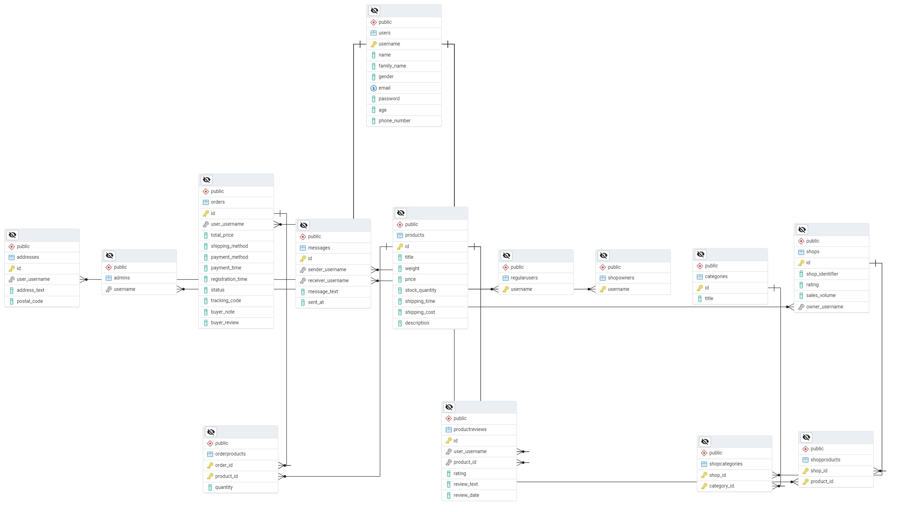

## Marketplace Database (PostgreSQL)

An end‑to‑end relational schema for a marketplace platform built on PostgreSQL, complete with sample data, retrieval queries, and an ERD diagram.

### ERD



### What's inside

- `DB Creation, Tables Creation, Data Insertion.sql`: Creates the `marketplace` database, all tables, constraints, and loads realistic sample data.
- `Queries (Retrieval).sql`: A collection of read-only queries to analyze the dataset (joins, filters, aggregations).
- `Query Results/`: CSV outputs for the retrieval queries.
- `ERD.png`: The entity–relationship diagram summarizing the schema.

### Schema overview

- `Users`: Core user profile fields with basic constraints (unique email, gender check, etc.).
- `Addresses`: Mailing addresses for users; cascades on user deletion.
- `ShopOwners` and `RegularUsers`: Role tables referencing `Users`.
- `Shops`: Stores with rating and sales volume; owned by a `User`.
- `Categories`: Product/shop categories.
- `ShopCategories`: Many‑to‑many relation between `Shops` and `Categories`.
- `Products`: Catalog with pricing, stock, shipping meta and description.
- `ShopProducts`: Many‑to‑many relation between `Shops` and `Products`.
- `Orders`: Purchases by users, with shipping/payment metadata and notes.
- `OrderProducts`: Line items for each order.
- `Messages`: Simple direct messaging between users.
- `ProductReviews`: Star ratings and text reviews for products.
- `Admins`: Admin users referencing `Users`.

Refer to the DDL file for exact column types, constraints, and keys.

### Getting started

Prerequisites:
- PostgreSQL 15+ (or a compatible version)
- `psql` CLI or a GUI (PgAdmin, DBeaver, etc.)

1) Create database, tables, and load sample data

Using `psql`:

```bash
# From the repository root
psql -U postgres -f "DB Creation, Tables Creation, Data Insertion.sql"
```

This script will:
- Create the `marketplace` database
- Define all relations and constraints
- Insert realistic sample data
- Reset sequences to align with inserted IDs

2) Run retrieval queries

```bash
psql -U postgres -d marketplace -f "Queries (Retrieval).sql"
```

Result sets for representative queries are provided under `Query Results/`.

### Example: exploring data

```sql
-- Total orders and revenue by shipping method
SELECT shipping_method,
       COUNT(*) AS num_orders,
       ROUND(SUM(total_price)::numeric, 2) AS gross_revenue
FROM Orders
GROUP BY shipping_method
ORDER BY gross_revenue DESC;
```
